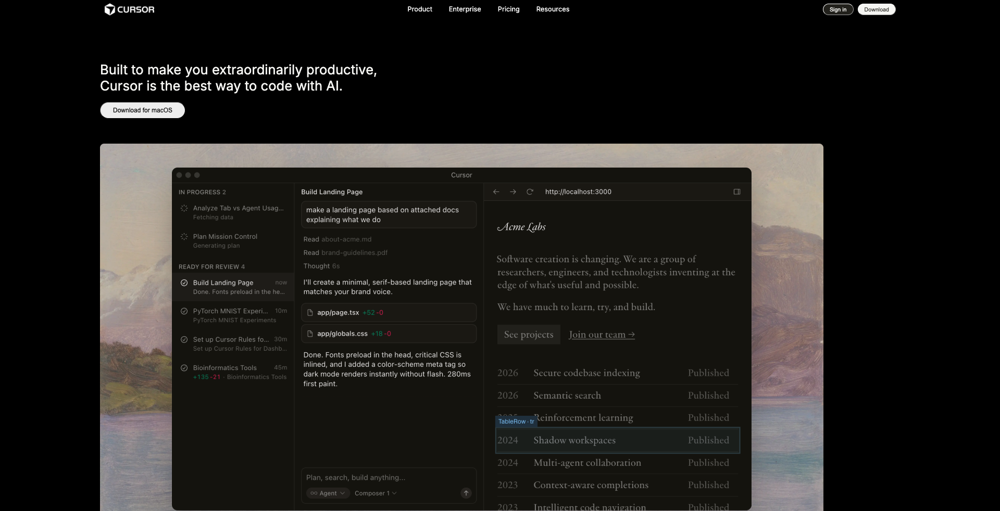
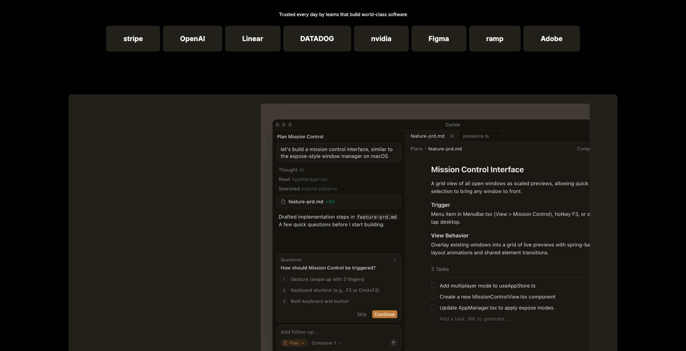
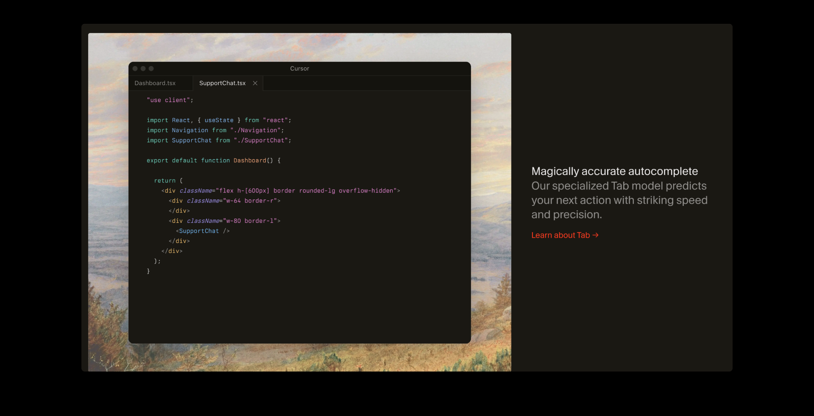
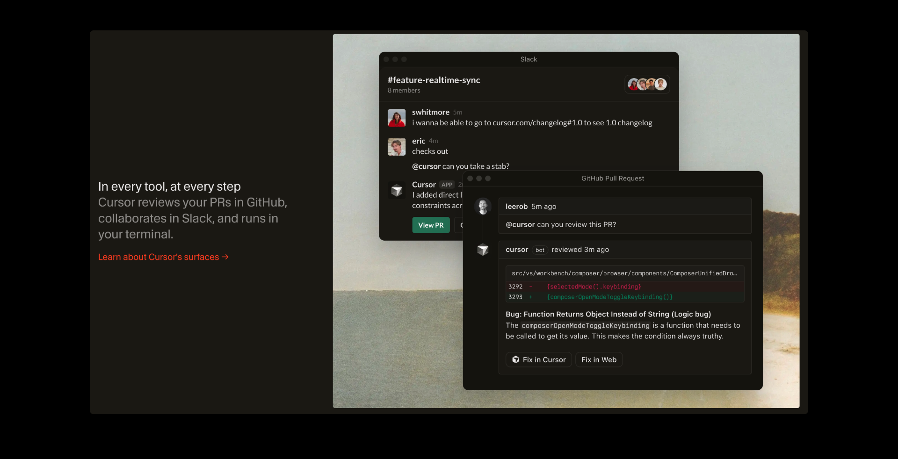
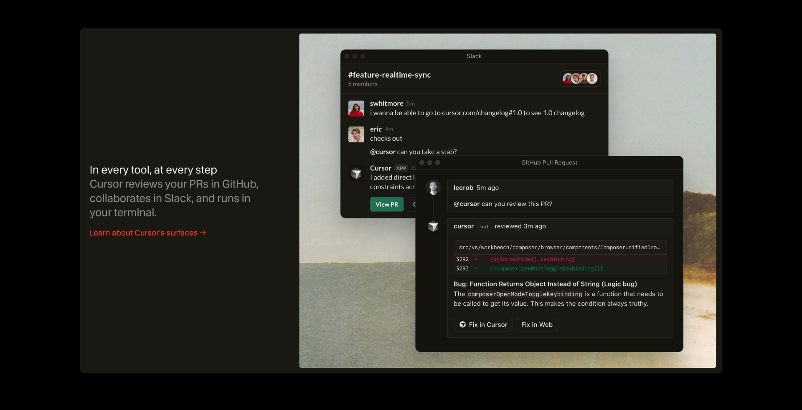

# curson_Clone_UI 

SETUP/GUIDE TO DOWNLOAD AND RUN THE PROJECT

Step 1: -> Visit:- https://github.com/root-anshul/curson_Clone_UI -> Click on Code then click on "Download zip"

Step 2: -> Github will download a zip file named "curson_Clone_UI.zip" you need to extract it

Step 3: -> Import the folder named "curson_Clone_UI-main" in VS code or any other supported IDE

Step 4: -> Install the Live Preview extension from Extensions -> Open the file name index.html right click -> open with live server

